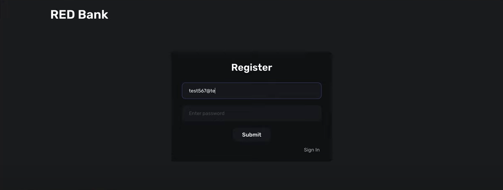
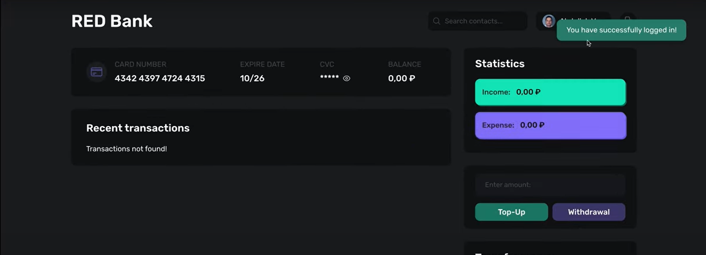
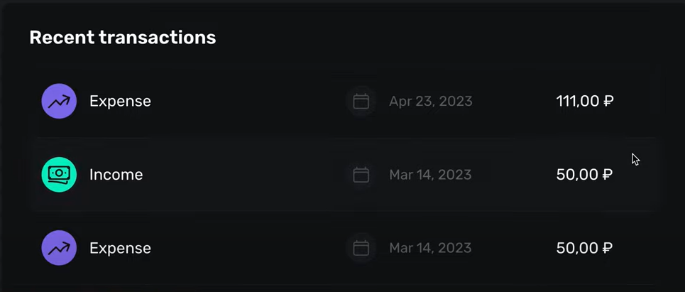
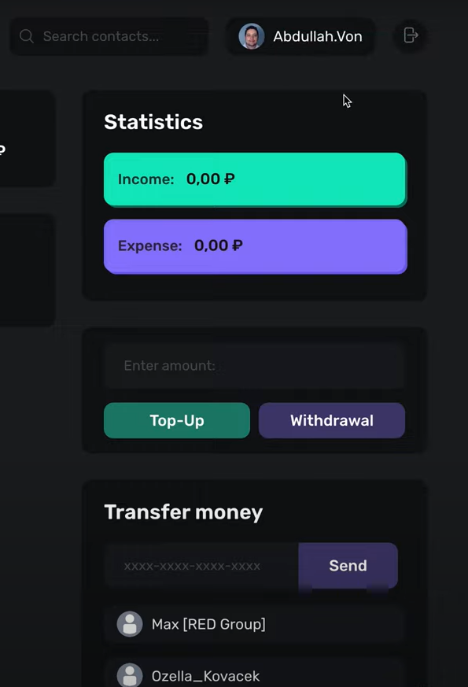

# ROMAN-BANK-JS

This repository contains a JavaScript implementation of a banking system that works with Roman numerals.

## About the Project

ROMAN-BANK-JS is a simple banking system developed in JavaScript. The system operates with Roman numerals, allowing basic banking operations such as account opening, deposit, withdrawal, etc., using Roman numbers.

## Features

- **Working with Roman numerals:** The system is fully adapted to work with Roman numbers, making it unique.
- **Bank account operations:** Users can open accounts, make deposits, withdraw funds, and view their account balances.
- **User interactions:** Interaction between users is implemented in the form of transactions. Users can transfer funds to each other.
- **Authorization:** A working user authorization system is included.
- **Working backend:** The repository also contains a working backend in the form of a zip file. The backend uses PostgreSQL as the database and Insomnia for API testing.

## Technologies Used

- JavaScript
- PostgreSQL
- Insomnia

## Running the Project

### Frontend
1. Make sure you have [Node.js](https://nodejs.org/) installed.
2. Navigate to the `frontend` directory.
3. Install dependencies by running:
   ```sh
   npm install
   
### Backend
1. Need to follow env file

### Screenshots








